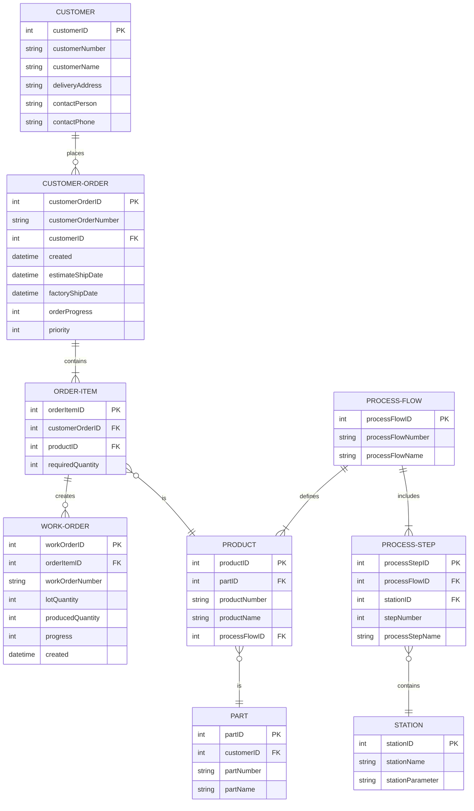

```mermaid
erDiagram
    CUSTOMER {
    	int customerID PK
    	string customerNumber
    	string customerName
    	string deliveryAddress
    	string contactPerson
    	string contactPhone
    }
    CUSTOMER-ORDER {
        int customerOrderID PK
        string customerOrderNumber
        int customerID FK
        datetime created
        datetime estimateShipDate
        datetime factoryShipDate
        int orderProgress
        int priority
    }
    ORDER-ITEM {
    	int orderItemID PK
    	int customerOrderID FK
        int productID FK
        int requiredQuantity
    }
    PRODUCT {
    	int productID PK
    	int partID FK
    	string productNumber
    	string productName
    	int processFlowID FK
    }
    PART {
    	int partID PK
    	int customerID FK
    	string partNumber
    	string partName
    }
    WORK-ORDER {
    	int workOrderID PK
    	int orderItemID FK
    	string workOrderNumber
    	int lotQuantity
    	int producedQuantity
    	int progress
    	datetime created
    }
    STATION{
    	int stationID PK
    	string stationName
    	string stationParameter
    }
    PROCESS-FLOW{
    	int processFlowID PK
    	string processFlowNumber
    	string processFlowName
    }
    PROCESS-STEP{
    	int processStepID PK
    	int processFlowID FK
    	int stationID FK
    	int stepNumber
    	string processStepName
    	
    }
    CUSTOMER ||--o{ CUSTOMER-ORDER : places
    CUSTOMER-ORDER ||--|{ ORDER-ITEM : contains
    ORDER-ITEM }o--|| PRODUCT : is
    PRODUCT }o--|| PART : is
    ORDER-ITEM ||--o{ WORK-ORDER : creates
    PROCESS-STEP }o--|| STATION : contains
    PROCESS-FLOW ||--|{ PROCESS-STEP : includes
    PROCESS-FLOW ||--|{ PRODUCT : defines
```

